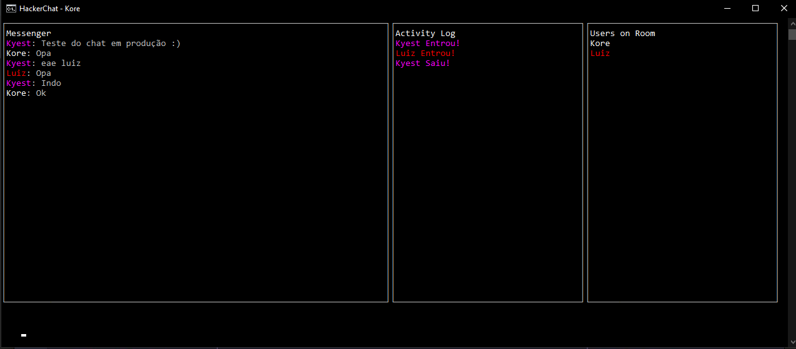
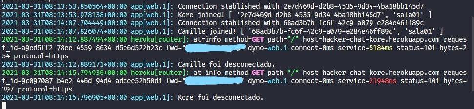

## "Hacker" Chat

Chat em terminal com Javascript puro multiplataforma. <br>enfocando a comunicação com WebSockets sem Socket.io, utilizando apenas o blessed como lib.
Inspirado no <a href="https://weechat.org/" target="_blank">WeeChat</a>.

## Preview





## 🗳 Install

```sh
npm i -g @korex7/hacker-chat-client
```

## 🚀 Usage

```sh
hacker-chat --username USER --room roomName
Exemplo: hacker-chat --username Kore --room 22
```